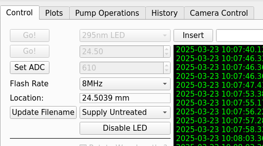

# Water Monitoring Control Software

To launch the water monitoring interface, navigate to the home folder in a terminal. 
If there is no terminal open, press `Ctrl+Alt+T` to launch one. 
Then, execute the `launch.sh` bash script. 
This will start the water quality monitoring GUI. 

1. [Interventions](#Interventions)

    a. [Water Leak Found](#water-leak-found)
    
    b. [Other Interventions](#other-interventions)

    c. [Bleeding Osmosis Pressure](#bleeding-osmosis-pressure)

2. [Taking Data](#taking-data)

    a. [Continuous Flow Monitoring](#continuous-flow-monitoring)

    b. [Regular Refill Monitoring](#regular-refill-monitoring)

    c. [No Flow Refill Monitoring](#no-flow-monitoring)

# Interventions

## Water Leak Found

### If the open tank (barrel) is overflowing 

1. Immediately, under "Control" pres "Stop Run"
2. Ensure all **no** boxes are checked under "Pump Operations." You may need to press "Stop Automation" on this tab, first. 

### If water is leaking near a darkbox

1. Immediately go to the "pump operations" tab and press the button on the top-left "Drain Chamber".
2. Contact an expert (Ben's CERN phone is on the whtieboard)
3. Once it is safe to do so, go to the WMS and clean up the spilled water. You may need to move the desy table left (using the LEFT red button) about 10cm. 
4. Under "Control" press "Stop Run" 
5. Once the chamber is drained, close the valves to WMS 

### Water Leak on the Bench 

1. If the leak is slow, follow the instructions above. 
2. Otherwise, you may just want to shut the valves to WMS to isolate it, and capture as much of the water as possible to minimize the spill. There is a bucket (and maybe a mop) by the water system fence.


## Other Interventions

### Bleeding Osmosis Pressure. 

# Taking Data

For each of these, an important first step is to ensure the LED flasher board is on and flashing. 

1. Choose the 410nm LED, press the "Go!" button beside it.
2. Press the "Set ADC" button; the value is not important. 
3. From the Flash Rate drop-down menu, choose "8MHz".
4. Choose the desired water type in the box below the board location, and then press "Update Filename"
5. Generally, the "Rotate Wavelengths?" button should be checked. Leave it unchecked only for data where just a specific wavelength is needed at high precision. See [One-LED Runs](#one-led-runs).



## Regular Refill Monitoring

**This may not work for RO water anymore.**

6. Select "Auto Refill?" You may need to de-select "Circulate Water?" if it is already checked. The GUI will not allow you to choose both. 
7. Choose a refill period, usually 60-90 minutes is good, and select the type of water to refill the chamber with. 
8. Press "Start Run." The WMS will automatically drain and fill the chamber, then repeat the refill at the selected frequency. Note the run number, and add it to the WMS runs spreadsheet. 
9. After a few data points have been taken, you will be able to view them. Under "Plots", you can click the top of the two white bars at the foot of the window. This will open a file browser: select the file whose run number is associated with the one just started. 

## Continuous Flow Monitoring

6. You will first need to fill the chamber with the appropriate water. Under the "Pump Operations" tab, choose the "Fill with..." button associated with the water type you would like to fill the chamber with. **If you are doing RO water, you will first need to fill the chamber with supply water**.
7. Now, back on the control tab, select "Circulate Water?" 
8. Choose a "Toggle Frequency" in minutes. Pumps will run for one minute, then wait for the chosen amount of minutes before running again. 3-5 minutes is good
9. Ensure you have selected the correct "Circulate With" water type. 
10. Press "Start Run"
11. See step 9, in [Regular Refill Monitoring](#regular-refill-monitoring)

## No Flow Monitoring 

6. Ensure no run is currently running. 
Follow step 6 in [Continuous Flow Monitoring](#continuous-flow-monitoring). 
7. Ensure "Auto Refill" and "Circulate Water" areboth unchecked.
8. See step 9, in [Regular Refill Monitoring](#regular-refill-monitoring)


## Other Data Taking Modes

### One-LED Runs

1. Choose the desired LED frequency from the drop-down menu at the top. Press "Go!" beside the drop down menu.
2. Select an appropriate ADC to get ~0.3 counts per pulse. Try just getting one from this table 

| nm  | ADC |
|-----|-----|
| 450 | 720 |
| 410 | 840 |
| 365 | 715 |
| 295 | 610 |
| 278 | 778 |
| 255 | 800 |

3. Select the MHz flash rate from the "Flash Rate" drop-down menu.
4. Choose which water type is present in the water drop down menu, beside the "Update Filename" button.
5. Make sure "Rotate Wavelengths?" is unchecked. 


## Filling or Draining the water chamber
Navigate to the `Pump Operations` tab, when there you should see a picture of the water filtration layout. 
In general, you should *only* need to use the automated buttons at most! 
Do not manually turn valves or pumps on unless you know what you are doing. 
The buttons:

 - Drain Chamber: drains the chamber
 - Fill with Supply Water: drains the chamber, then fills with water from the supply line
 - Fill with Return Water: drains the chamber, then fills with water from the return line. Also known as tank water
 - Fill with Osmosis: drains the chamber, then fills with reverse osmosis water. This takes about 45 minutes. You may see it periodically pressurizing the RO pressure vessel, waiting as the RO tank fills, and then waiting as the RO tank fills the chamber. It'll swap between these frequently. 

# What to do when... 

## Air keeps getting pumped into the return line. 

This happens when there is no water in the open tank (the white plastic drum), but the return pump keeps running (a relatively quiet pump). 
If this keeps happening, turn the WMS cabinet off (you will see the green lights turn off), and contact the experts (Ben Smithers - bsmithers@triumf.ca - CERN Phone 69399).

## Major Leak is found

If a major leak occurs, like a pipe becoming unseated or worse. 

1. Stop the leak if possible. 
2. Isolate the system. 
3. Fix the leak, if possible. 
4. Contact the experts (see above)

You can probably hold your finger over an unseated tube. 

The system can be isolated by closing the valves in the corner between the WMS cabinet, the WCTE tank, and the wall. 
 

## You get a high-pressure warning
The system should automatically turn SV1, SV2, and PU1 off.
If it does not, make sure those boxes do not have a check-mark. 
This should shut off the high-pressure water supply to the system.

Then, contact [Add name and contact later so it's not on github].

## You get a high-temperature warning. 

This is likely the UV sterilizer. Power the UV sterilizer down and then contact [Add name and contact later so it's not on github]. 
Note: you will probably have to physically flip a switch or unplug a cable. You can not power up or power down the UV sterilizer through the GUI.

## You see mechanical timeout errors

Don't worry about those

## A problem not mentioned here. 	

Often, it's useful to just restart the whole thing.

1. On the `Control` tab, press "Stop Run" if that button is there. 
2. On the `Pump Operations` tab, press "Stop Automation" if that button is click-abble and enabled. 
3. On that tab, if any checkboxes were checked, uncheck them. 
4. Close the window. Press Yes.
5. Restart the gui. In the open terminal re-run `python launch.py` 


## You get a [...] not found error

Odds are permissions are set up wrong for the LED board or for the linear stage. 

### Verify the paths
Check the paths listed in the `constants.py` script in the full file path
```
    /home/watermon/software/StageControl/StageControl/gui
```
Ensure that the `LED_BOARD_USB` and `STAGE_USB` entries point to real file paths. 
You can check by running 
```
    ls -lh /path/listed/in/file
```
If those do not exist, but something similarly named does, you could try using the similarly named entries.
If there are no such entries, contact an expert. 
If they _do_ exist, check the permissions (see below). 

### Set the permissions 

For each of those paths, try running 
```
    sudo chmod 666 /path/listed/in/file
```
You will need the password used to log in to this machine. 

If errors persist, contact an expert.

## First time setup 

You will need a monitor and a keyboard for first-time setup. A keyboard is optional. 
Once the setup is complete, these are not longer required. 

### Network Setup 

Plug the ethernet cable in to the computer, turn the computer on, and sign in. 
If we have been provided with a network address, you can go to the Static IP section below. 
Otherwise, go to the dynamic IP section beneath that. 

#### Static IP 

On the top right corner, click the arrow pointing down and select settings. 
Under "network" click the gear under the "wired" connection category. 
Choose "manual" under IPv4, then enter in the IP Address, the netmask, and the gateway. If a DNS is provided, enter that in too. If not, you can use `8.8.8.8` or `8.8.4.4`; these are popular google-managed DNS servers. 

You should now be able to access the internet on the computer. 
If a domain name (like, `watermon.cern.ch`) was provided, you should be able to SSH to that address. 

#### Dynamic IP 

If _no_ static IP address was provided, then instead we'll have to use a dynamic address. 
On the top right corner, click the arrow pointing down and select settings. 
Under "network" click the gear under the "wired" connection category, then click "Automatic" under IPv4 method. 
Press apply.  
Wait a moment as the connection establishes. 
You will then need to open a web browser (the computer already has firefox), and should try to go to a CERN webpage and proceed with the normal CERN device registration. 

Afterwards, run `ifconfig` in a terminal. You will see an output like 
```
enp1s0: flags=4163<UP,BROADCAST,RUNNING,MULTICAST>  mtu 1500
        inet 10.1.3.129   netmask 255.255.224.0  broadcast *************
        inet6 ************  prefixlen 64  scopeid 0x20<link>
        ether ************  txqueuelen 1000  (Ethernet)
        RX packets 13888376  bytes 1383517057 (1.3 GB)
        RX errors 0  dropped 108953  overruns 0  frame 0
        TX packets 199207  bytes 249137742 (249.1 MB)
        TX errors 0  dropped 0 overruns 0  carrier 0  collisions 0
```

The number beside `inet` is the machine's IPv4 address. You can now SSH directly to the machine like so
For instance:
```
    ssh watermon@10.1.3.129 
```
### Setting up the LED board and the Stage 

Before plugging in anything, run
```
ls /dev/ | grep USB
```
and note what shows up. It might be nothing.
Plug in the LED board, and run the command again.
You will likely see something has appeared now, highlight the filepath it shows and copy it (Ctrl+Shift+C).
Open the path list at 
```
/home/watermon/software/StageControl/StageControl/gui/constants.py 
```
and replace the path definition for `LED_BOARD_USB` with the path you just copied. 
Save this file, then plug in the thorlabs stage. 
Run the same `ls` command, and note that a second path has appeared. Copy the new one, and add it to the `STAGE_USB` variable in the same file as before

Now, run 
```
    sudo chmod 666 /dev/tty.USB0
    sudo chmod 666 /dev/tty.USB1
```
where you will replace each path with the ones from before. 
The password will be the same as the one you logged in with. 

Now if you launch the gui,
```
   /home/watermon/launch.sh
```
it should start up successfully. 
You should also now be able to control the LED board and the stage through the GUI.
Test it out, try selecting different wavelengths and make sure it actually lights up and moves. 

#### Setting up the Pumps and stuff

This still needs some work, will add this soon.

